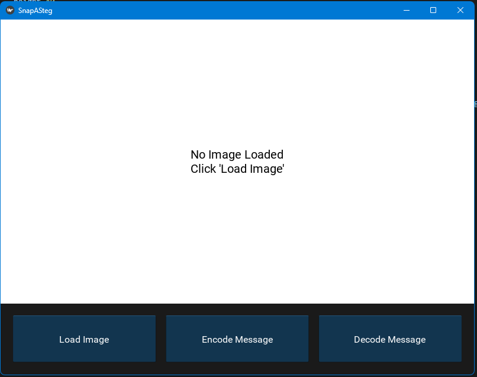
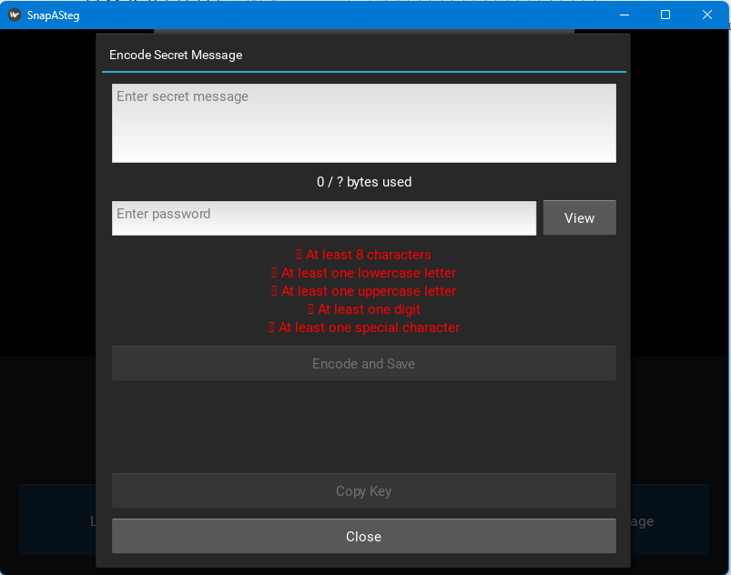
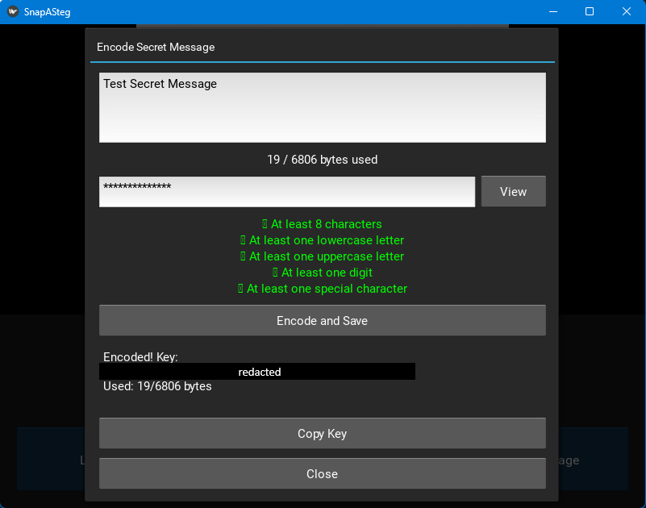
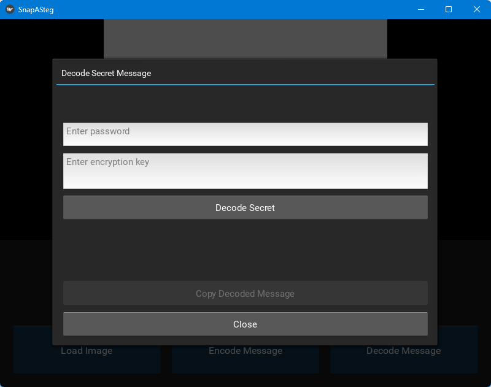
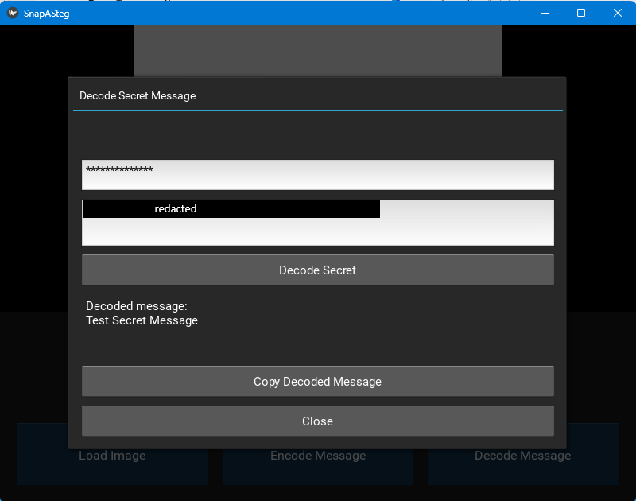

# Snap-A-Steg

Snap-A-Steg is a standalone desktop application for secure steganography and encrypted messaging using image files. 
Easily hide and reveal secret messages protected by passwords and unique encryption keys. 
Designed with privacy and simplicity in mind, Snap-A-Steg supports secure communication through image steganography. Open source and cross-platform support planned.

## Features

- Embed secret messages into images with password protection for private and secure messaging
- Decode hidden messages with the correct password and key  
- Overwrite existing messages in images  
- Real-time password strength feedback
- Byte counter to alert how large of a message you can send
- Randomly assigned unique encryption keys for enhanced security
- Simple and intuitive GUI  

## Installation

1. Clone the repository:  
   ```bash
   git clone https://github.com/argeincharge/snap-a-steg.git
   ```
2. Install dependencies (requires Python 3.8+):
   ```bash
   pip install -r requirements.txt
   ```
3. Run the app:
   ```bash
   python snap_a_steg.py
   ```

## Usage
- Load an image file in the app
- Open the Encode popup to write and password-protect your secret message
- Save the encoded image and keep the encryption key safe
- Use the Decode popup to retrieve messages from encoded images

## Screenshots

### Main Interface


### Encode Popup


### Encode Popup Results


### Decode Popup


### Decode Popup Results

  

## License
This project is licensed under the GNU General Public License v3.0 (GPLv3). See the LICENSE file for details.


Feel free to open issues or submit pull requests!

